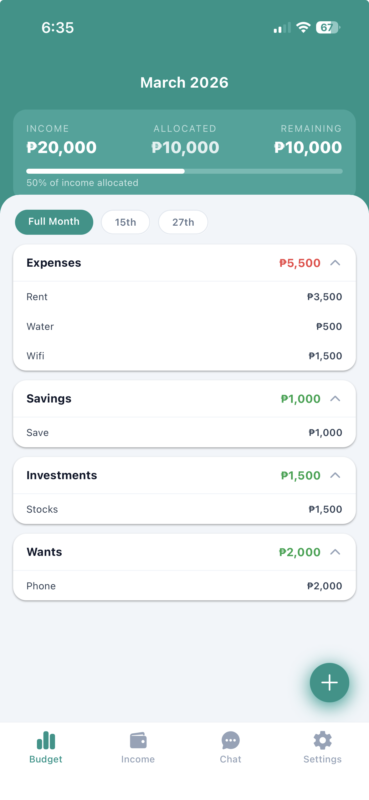
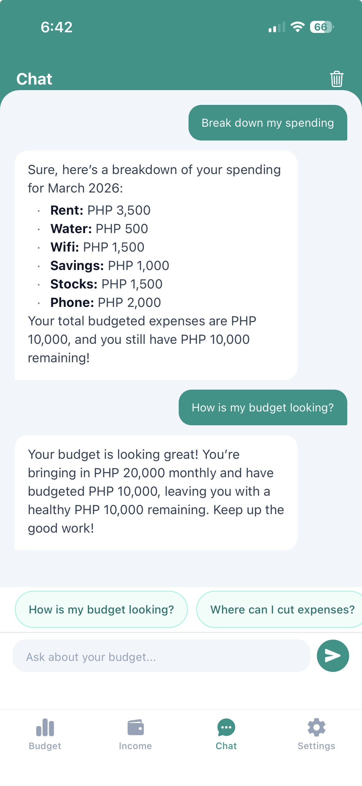

# SaveNa

A personal budgeting app for Filipinos built with React Native and Expo, designed around pay schedules. Track income sources, allocate budgets across pay periods, and stay on top of monthly expenses — all stored locally on device with no account required.

---

## Download

[Download latest APK (Android)](https://github.com/janing06/save-na/releases/latest)

---

## Screenshots

<p align="center">
  
  
</p>

---

## Features

- **Income Sources** — Add multiple income sources with monthly, bi-monthly, bi-weekly, or weekly pay schedules
- **Per-Payday Amounts** — Specify different amounts per pay day for bi-monthly salaries (e.g. ₱8,000 on the 15th, ₱12,000 on the 30th)
- **Budget Items** — Create budget items per income source, grouped by category
- **Pay Period Split** — Budget items split evenly across pay periods by default, with optional custom per-period amounts
- **Mark as Paid** — Track which budget allocations have been paid each period
- **Month Navigation** — Browse past months; forward navigation locked at current month
- **Multiple Currency Support** — Choose your preferred currency during onboarding
- **Categories** — Organize budget items by category; create and manage custom categories in Settings
- **Payday Notifications** — Get notified on payday and reminded 2 days later to check off budget items; configurable per income source with custom times
- **Total Tab Source Labels** — Budget items in the Total tab show which income source they belong to, grouped by source for easy comparison
- **AI Chat Assistant** — Ask questions about your budget and spending using an AI assistant powered by OpenRouter; requires a free API key and internet connection
- **Clear All Data** — Reset the app to a clean state from Settings

---

## Tech Stack

| Tool | Purpose |
|------|---------|
| [Expo](https://expo.dev) (SDK 54) | Managed React Native framework |
| [React Native](https://reactnative.dev) | Cross-platform mobile UI |
| [TypeScript](https://www.typescriptlang.org) | Type safety |
| [Expo Router](https://expo.github.io/router) | File-based navigation |
| [expo-sqlite](https://docs.expo.dev/versions/latest/sdk/sqlite/) | On-device SQLite database |
| [TanStack React Query](https://tanstack.com/query) | Server state, caching, and cache invalidation |
| [Jotai](https://jotai.org) | Global atom state |
| [NativeWind](https://www.nativewind.dev) | Tailwind CSS utility classes for React Native |
| [OpenRouter](https://openrouter.ai) | AI chat API with multi-model fallback (free + paid models) |
| [Biome](https://biomejs.dev) | Linting and formatting |
| [EAS Build](https://docs.expo.dev/build/introduction/) | Cloud builds for Android and iOS |
| [Claude Code](https://claude.ai/claude-code) | AI-assisted development |

---

## Project Structure

```
save-na/
├── client/                             # Expo React Native app
│   └── src/
│       ├── app/                        # Expo Router entry, layout, tab routes
│       │   ├── (tabs)/                 # Tab navigator (budget, income, settings)
│       │   └── onboarding/             # Onboarding flow (currency, income source)
│       ├── pages/                      # Feature pages (FSD architecture)
│       │   ├── budget/                 # Budget screen
│       │   │   ├── api/                # listBudgetItems, createBudgetItem, togglePaid, etc.
│       │   │   ├── model/hooks/        # useBudgetItems, useCreateBudgetItem, usePayPeriodToggle, etc.
│       │   │   └── ui/                 # BudgetPage + BudgetPageContainer, modals, accordions
│       │   ├── income/                 # Income sources screen
│       │   │   ├── api/                # listIncomeSources, createIncomeSource, updateIncomeSource
│       │   │   ├── model/hooks/        # useIncomeSources, useCreateIncomeSource, etc.
│       │   │   └── ui/                 # IncomePage + IncomePageContainer, modal, card
│       │   ├── chat/                   # AI chat assistant screen
│       │   │   ├── api/                # chat-db (message persistence)
│       │   │   ├── model/hooks/        # useChatMessages, useSendMessage, useApiKey, etc.
│       │   │   └── ui/                 # ChatPage + ChatPageContainer, ChatBubble, ChatSetupPrompt
│       │   ├── settings/               # Settings screen
│       │   │   ├── model/hooks/        # usePreferences, useCategories, useClearData, etc.
│       │   │   └── ui/                 # SettingsPage + SettingsPageContainer
│       │   └── onboarding/             # Onboarding flow
│       │       ├── api/                # completeOnboarding, saveIncomeSource
│       │       ├── model/hooks/        # useOnboarding
│       │       └── ui/                 # WelcomePage, CurrencyPage, IncomeSourcePage
│       └── shared/                     # Cross-feature utilities
│           ├── config/                 # Currency list
│           ├── db/                     # SQLite client, schema, migrations, seed, queries
│           └── lib/                    # Types, pay period logic, date utils, query keys
│
└── .github/
    └── workflows/
        ├── check-pr-client.yml              # PR checks: TypeScript, Biome lint, FSD, Knip
        ├── eas-build-android.yml            # Manual EAS build — Android APK
        ├── eas-build-android-production.yml # Manual EAS build — Android AAB (Production)
        ├── eas-build-ios.yml                # Manual EAS build — iOS Simulator
        ├── eas-build-pr-preview.yml         # Manual EAS build — PR preview APK with PR comment
        └── eas-update.yml                   # OTA update on push to main or manual trigger
```

---

## Architecture

The app follows **Feature-Sliced Design (FSD)** with a **container/presentation** pattern:

- **Container** (`*-page-container.tsx`) — composes hooks, owns data fetching and mutations
- **Presentation** (`*-page.tsx`) — pure UI, receives everything via props

All data is stored **locally on device** using SQLite via `expo-sqlite`. There is no backend — no accounts. The AI chat feature uses OpenRouter's API and requires a free API key and internet connection. TanStack Query wraps all DB calls for caching and invalidation.

Pay period logic is computed in-memory from the income source's schedule and pay dates, not stored in the database.

---

## CI/CD

### PR Checks

| Workflow | Trigger | What it does |
|----------|---------|--------------|
| `check-pr-client.yml` | PR touching `client/**` | TypeScript type check, Biome lint, FSD architecture validation (steiger), dead code check (knip) |

### Builds

| Workflow | Trigger | What it does |
|----------|---------|--------------|
| `eas-build-android.yml` | Manual (`workflow_dispatch`) | EAS cloud build — Android APK |
| `eas-build-android-production.yml` | Manual (`workflow_dispatch`) | EAS cloud build — Android AAB (Production) |
| `eas-build-ios.yml` | Manual (`workflow_dispatch`) | EAS cloud build — iOS Simulator |
| `eas-build-pr-preview.yml` | Manual (`workflow_dispatch`) | Builds a preview APK and comments the download link on the PR |
| `eas-update.yml` | Push to `main` touching `client/**` or manual | Publishes an OTA update via EAS Update |

---

## Local Development

### Prerequisites

- Node.js 22+
- [Expo Go](https://expo.dev/go) app on your device or an Android/iOS simulator

### Setup

```bash
cd client

# Install dependencies
npm install

# Start the dev server
npx expo start
```

Scan the QR code with Expo Go, or press `a` for Android emulator / `i` for iOS simulator.

### Quality checks

```bash
# TypeScript
npm run ts:check

# Lint
npm run lint

# FSD architecture validation
npm run fsd

# Dead code check
npm run knip
```
